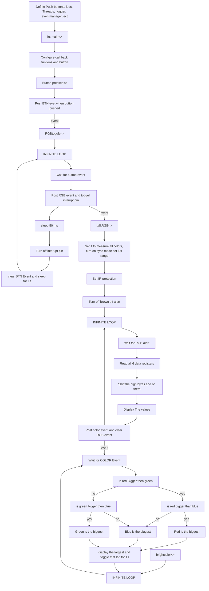

# Program: RGB sensor Self directed learning
**Author(s):**  Milan Johnson
**Date:**1/24/25

**Modified by:**  
**Date:**

**Purpose:** When a button is pushed the RGB sensor takes a measuremnt and displays it and shows witch color is the greatest value.

## Configuration

Devicetree overlay:

Set up the ISL29125 I2C connection
Disaible the other channles 
Set up the pushbutton
Set up the Int pin at an led
Configure the 3 leds for brightest colors

Kernel configuration via `prj.conf`:
events 
I2C
CBPRINTF_FP_SUPPORT
LOG

## Hardware
### External
1 ISL29125 RGB sensor
1 Push button
3 leds + 3 resistors 
### Internal

## Flow

